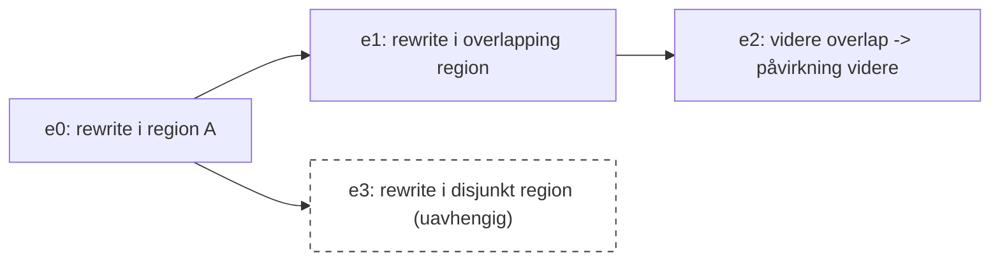
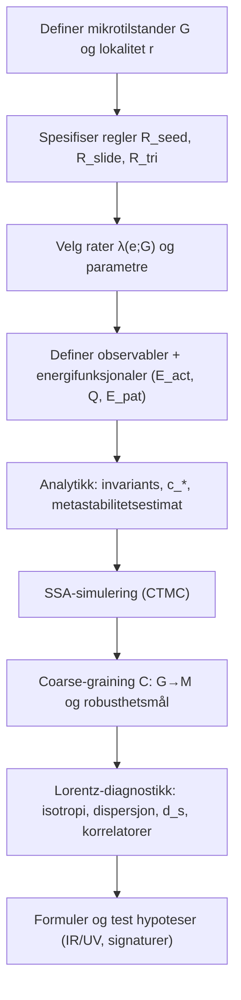

# Minimal dynamisk-relasjonell universgraf

[Last ned rapporten (Markdown)](sandbox:/mnt/data/rapport.md)

## Executive summary

Denne rapporten formulerer et **presist, minimalt matematisk rammeverk** for idéen i samtalen: universet er en bakgrunnsløs, dynamisk relasjonsgraf der den eneste primitive strukturen er **noder og én relasjonstype**; **units of action** er lokale, stokastiske omskrivningshendelser (graf‑rewriting); **tid** oppstår som hendelsestelling; **spacetime** og **partikler** er emergente mønstre; **entanglement** er korrelasjon/ikke‑separabilitet; og “seeds” kan oppstå kontinuerlig men er bare operasjonelle når de kobles til samme komponent.

Rapportens kjerne er en minimal klasse av **tre** lokale omskrivningsregler (innenfor kravet 2–4 regler) uttrykt i graph‑grammar/DPO‑notasjon, med kontinuerlig‑tid Markov‑jump‑semantikk:

- **R_seed** (leaf birth/death): absorberer nye noder inn i den operasjonelle komponenten ved å feste en grad‑1 node til en eksisterende node (og revers: fjerne en ekte leaf).  
- **R_slide** (edge slide): flytter et endepunkt av en kant langs en nabokant (lokal transport/bevegelse ved ren relasjonsombinding).  
- **R_tri** (triad closure/opening): lukker en “wedge” til en trekant (lokal koherens/”feltlag”), og åpner ved å fjerne kanter med en støtte‑avhengig rate (mikromekanisme for robusthet/feilkorrigering).

DPO‑rammeverket (double pushout) gir et strengt begrep om lokale graftransformasjoner (inkludert sletting uten hengende kanter), og en nylig formalisering i teorembeviser styrker den matematiske påliteligheten til dette valget. citeturn8view0

For stokastikk brukes en standard kontinuerlig‑tid jump‑prosess (CTMC), med total intensitet \(\Lambda(G)=\sum_e \lambda(e;G)\). Den klassiske “stochastic simulation algorithm” (SSA) gir en direkte og eksakt simuleringsmetode for slike prosesser, og kan brukes nærmest uendret her. citeturn8view4turn6view4

Energi konstrueres på to komplementære vis som respekterer samtalens premiss om at energi springer ut av “units of action”:

1) **Aktivitetsbasert energi** \(E_\mathrm{act}(G)=\Lambda(G)\), som måler total tilgjengelig hendelsesrate (action‑kapasitet) i mikrotilstanden. Dette er naturlig i CTMC‑semantikk, men er generelt ikke eksakt bevart.

2) **Noether‑lignende makroladninger** \(Q(G)\) som eksakte (eller tilnærmede) invariants av regelsettet, konstruert som lineære kombinasjoner av motivtall (noder, kanter, korte sykler). Et sentralt eksempel er syklomatisitet \(\beta_1=|E|-|V|+1\), som er **eksakt invariant** under \(\{R_\mathrm{seed},R_\mathrm{slide}\}\), men har kilde/senk under \(R_\mathrm{tri}\).

I tillegg beskrives en mønsterenergi \(E_\mathrm{pat}(G)=\sum_p \varepsilon_p N_p(G)\) som “Hamiltonsk” funksjonal: den er typisk ikke bevart, men kan gjøres til styrende for en unik likevektsfordeling \(\pi(G)\propto e^{-E_\mathrm{pat}(G)}\) dersom rater velges med detaljbalanse. Dette knytter direkte an til “thermodynamic graph‑rewriting”, som gir en generell konstruksjon av detaljbalanserte rater gitt energimønstre. citeturn8view1

Stabilitet og “partikler” formaliseres som metastabilitet i Markov‑prosesser: langlivede klustre/loops oppstår når lokale åpninger er sterkt undertrykt (f.eks. ved støtte‑avhengige åpningrater), slik at forventet levetid kan vokse eksponentielt med en lokal redundansparameter. citeturn3search9turn3search17turn8view1

Relativistisk kinematikk analyseres på modellens egne premisser: lokale regler gir kausale kjegler og en maksimal propagasjonshastighet \(c_*\) i grafavstand per hendelsesteg, i ånd av formalismen “causal graph dynamics”. citeturn5view2turn3search7 Som analogi (på effektive nivåer) viser lokalitet i mange‑legeme‑fysikk at det finnes en endelig informasjonsfront (Lieb–Robinson‑type begrensninger). citeturn6view3turn1search14turn7search2

Et særskilt viktig kritisk punkt gjelder emergent Lorentz‑likhet: causal set‑teori viser at en tilfeldig punktprosess kan være kompatibel med Lorentz‑symmetri, men også at det finnes sterke begrensninger på å utlede en **endelig‑valens** graf fra en slik sprinkling uten å bryte symmetrien. Dette er relevant fordi mange dynamiske grafmodeller (inkludert den minimale her) naturlig søker lav/bundet grad. citeturn8view8turn2search7 Derfor foreslås konkrete numeriske diagnostikker (anisotropi, dispersjon, spektral dimensjon, korrelatorer) som kan brukes til å avgjøre om en Lorentz‑lik lavenergi‑symmetri faktisk oppstår.

## Mikrotilstander, lokalitet og minimale omskrivningsregler

### Modellantagelser og bevisst minimale valg

Vi låser eksplisitt de antagelsene som er gitt i samtalen:

- Universet er en **dynamisk graf** av noder og relasjoner, med **én relasjonstype**.  
- En **unit of action** er et lokalt graf‑rewrite som endrer relasjoner.  
- Endring er **stokastisk**.  
- **Tid** er hendelsesbasert (teller av rewrites), og klokker må være interne mønstre.  
- “Seeds” kan oppstå utenfor, men er operasjonelle bare når de blir koblet til samme komponent.  
- Spacetime, felter og partikler er **emergente statistiske/regime‑begreper**.  
- Entanglement er **korrelasjon/ikke‑separabilitet**, ikke superluminal signalering.

Det er samtidig flere detaljer som er **uspesifiserte** (f.eks. rettet/urettet graf, multikanter, self‑loops som primitive, og om noder har interne tilstander). For en streng minimalmodell velges:

- **Mikrotilstander:** endelige, urettede, enkle grafer uten isolerte noder.  
- **Semantikk:** algebraisk graftransformasjon i DPO‑stil. citeturn8view0  
- **Stokastikk:** kontinuerlig‑tid jump‑prosess (CTMC) med rater per lokal match. citeturn6view4turn8view4turn4search13  

Valgene over er kompatible med standard teori for graftransformasjoner og stokastisk grafrewriting (og kan senere generaliseres dersom man ønsker rettede grafer, typed graphs, osv.). citeturn8view0turn6view4

### Mikrotilstandsrom og operasjonell komponent

En mikrotilstand er en graf \(G=(V,E)\) med \(\deg(v)\ge 1\) for alle \(v\in V\). Vi bruker merkede grafer som representasjon, men krever at regler og rater er **permutasjonsinvariante** (ingen fysisk betydning av node‑ID).

Formelt:

\[
\mathcal{G}_n := \{G=(V,E)\mid V=\{1,\dots,n\},\ G\text{ enkel urettet},\ \deg(v)\ge 1\},
\qquad
\mathcal{G} := \bigsqcup_{n\ge 1}\mathcal{G}_n.
\]

Den globale “seed‑kosmologien” kan ha mange disjunkte komponenter, men vi definerer en **operasjonell komponent** \(G^\star\) (komponenten som inneholder et observatør‑kluster, eller i simulering: den største komponenten). Alle “fysiske” observerbare størrelser forstås som definert relativt til \(G^\star\). Dette formaliserer idéen om at ukoblede seeds ikke eksisterer for hverandre.

### Lokalitet via grafavstand og radius r

Grafavstand \(d_G(u,v)\) er korteste sti-lengde. Definer ballen:

\[
B_r(v)=\{u\in V: d_G(u,v)\le r\}.
\]

En lokal regel har støtte \(\mathrm{supp}(e)\subseteq V\) og “radius” \(r\) dersom \(\mathrm{diam}_G(\mathrm{supp}(e))\le r\). Dette er et koordinatfritt lokalitetsbegrep som er nettopp den typen “bounded speed”‑premiss som formaliseres i “causal graph dynamics”. citeturn5view2turn3search7

### Graph grammar (DPO) og negative applikasjonsbetingelser

En (DPO) omskrivningsregel er en span:

\[
\rho:\quad L \xleftarrow{\ell} K \xrightarrow{r} R
\]

i kategorien av (finite) grafer og injektive homomorfier. Match \(m:L\to G\) må oppfylle gluing‑krav; resultatet \(G'\) konstrueres ved pushout‑komplement + pushout. citeturn8view0

Reglene våre trenger betingelser som “kanten finnes ikke”. Slike betingelser håndteres som **negative application conditions** (NAC); DPO‑rammeverk og praksis i graftransformasjon støtter dette som standard utvidelse. citeturn0search16turn8view0

### Stokastisk semantikk: CTMC og generator

En hendelse er \(e=(\rho,m)\) der \(\rho\) er en regel og \(m\) en match. Til hver hendelse knyttes en rate \(\lambda(e;G)\). Total intensitet:

\[
\Lambda(G)=\sum_{e\in\mathcal{E}(G)}\lambda(e;G).
\]

CTMC‑generatoren for en observabel \(F\) er:

\[
(\mathcal{L}F)(G)=\sum_{e\in\mathcal{E}(G)} \lambda(e;G)\,[F(G^e)-F(G)].
\]

Dette er standard jump‑prosess‑semantikk; SSA gir direkte sampling av neste hendelse og ventetid. citeturn8view4turn6view4turn4search13

### Minimal regelklasse med eksplisitt graph‑grammar‑notasjon

Vi gir tre regler. “Radius” oppgis med hensyn til grafavstand i \(G\).

#### R_seed: leaf birth/death (radius 1)

**R_seed,birth** (feste ny node x til v)

- \(L\): én node \(v\)  
- \(K\): én node \(v\)  
- \(R\): to noder \(v,x\) med kant \((v,x)\)

**R_seed,death** (fjerne en ekte leaf x)

- \(L\): noder \(v,x\) med kant \((v,x)\)  
- \(K\): node \(v\)  
- \(R\): node \(v\)

NAC/betingelse: \(\deg(x)=1\) (x må være leaf), slik at sletting er veldefinert i DPO uten hengende kanter.

**Rater**

\[
\lambda_{\mathrm{birth}}(v;G)=\alpha_b\,f_b(\deg(v)),
\qquad
\lambda_{\mathrm{death}}(x\!\to\!v;G)=\beta_b\,f_d(\deg(v))\,\mathbf{1}[\deg(x)=1].
\]

Her er \(f_b,f_d\ge 0\) lokale funksjoner (valg er uspesifisert av samtalen).

#### R_slide: edge slide (radius 2)

Mønster: tre distinkte noder \(a,b,c\) med kanter \((a,b)\), \((b,c)\) og NAC \((a,c)\notin E\). Omskriv:

- slett \((a,b)\)  
- legg til \((a,c)\)  
- behold \((b,c)\).

Graph‑grammar:

- \(L\): \(a\!-\!b\!-\!c\) (to kanter)  
- \(K\): bevar \((b,c)\) og alle tre noder  
- \(R\): \(a\!-\!c\) og \(b\!-\!c\)

**Rate**

\[
\lambda_{\mathrm{slide}}(a,b,c;G)=\alpha_s\,f_s(\deg(a),\deg(b),\deg(c))\,\mathbf{1}[(a,c)\notin E].
\]

#### R_tri: triad closure/opening (radius 2)

**R_tri,close** (lukk wedge u–v–w)

- \(L\): kanter \((u,v)\), \((v,w)\) og NAC \((u,w)\notin E\)  
- \(K\): \(L\) (alt bevares)  
- \(R\): \(K\cup\{(u,w)\}\)

**R_tri,open** (åpne ved å slette kant \((u,w)\))

- \(L\): noder \(u,w\) med kant \((u,w)\)  
- \(K\): noder \(u,w\) uten kant  
- \(R\): \(K\)

Definer støtte:

\[
s(u,w;G)=|N(u)\cap N(w)|.
\]

**Rater**

\[
\lambda_{\mathrm{close}}(u,v,w;G)=\alpha_t\,f_t(\deg(u),\deg(v),\deg(w))\,\mathbf{1}[(u,w)\notin E],
\]

\[
\lambda_{\mathrm{open}}(u,w;G)=\beta_t\,g_t(s(u,w;G))\,\mathbf{1}[(u,w)\in E],
\]

der et robusthetsvalg er \(g_t(s)=e^{-\gamma s}\) med \(\gamma>0\), slik at godt støttede kanter er vanskelige å bryte.

### Tabell: regler, strukturelle effekter og forventet emergens

| Regel | Endrer | Bevarer | Typisk emergent tolkning | Risiko/feilmodus |
|---|---|---|---|---|
| R_seed | \(|V|,|E|\) | \(|E|-|V|\) og \(\beta_1\) (på \(G^\star\)) | volumvekst, absorpsjon av seeds | treregime (snittgrad nær 2) om R_tri er svak |
| R_slide | grad lokalt | \(|V|,|E|,\beta_1\) | transport/bevegelse som relasjonsombinding | anisotropi hvis \(f_s\) gir skjult preferanse |
| R_tri | \(|E|,\beta_1\), clustering | \(|V|\) | lokalt koherenslag (“felt”), sløyfegenerasjon | runaway tetthet hvis open ikke balanserer close |

## Energifunksjonaler, invariants og bevaring

### To energibegreper som faktisk kan testes i denne modellen

Samtalen spør om stabilitet i et selvkonfigurerende univers “presser” mot energibevaring. I graf‑rewriting‑setting er det avgjørende å skille mellom:

- **Energi som hendelsesressurs** (hvor mye dynamikk som er tilgjengelig per intern tid).  
- **Energi/ladning som invariant** (det som ikke kan endres av lokale regler, eller bare endres ved sjeldne hendelser).

Begge kan formaliseres uten å innføre nye primitive objekter.

### Aktivitetsbasert energi: \(E_\mathrm{act}=\Lambda(G)\)

Definer:

\[
E_\mathrm{act}(G)=\Lambda(G)=\sum_{e\in\mathcal{E}(G)}\lambda(e;G).
\]

Dette er mål på “units‑of‑action‑intensitet” i tilstanden. I SSA er forventet tid til neste hendelse \(1/\Lambda(G)\). citeturn8view4turn6view4

**Eksakt bevaring?** Nesten aldri: enhver endring i antall matcher (wedges, leaves, kanter) endrer \(\Lambda\). Men \(E_\mathrm{act}\) kan bli *stasjonær i forventning* i et stabilt makroregime der lokale statistikker er stasjonære.

### Noether‑lignende makroladning: eksakte invariants av reglene

La \(\mathbf{N}(G)\in\mathbb{Z}^k\) være en vektor av tellefunksjoner (noder, kanter, trekanter, etc.). For en hendelse \(e\) definer endringen \(\Delta(e)=\mathbf{N}(G^e)-\mathbf{N}(G)\). Hvis \(\mathbf{w}\cdot\Delta(e)=0\) for alle tillatte \(e\), er:

\[
Q_\mathbf{w}(G)=\mathbf{w}\cdot\mathbf{N}(G)
\]

eksakt bevart.

**Eksempel: syklomatisitet.** På en sammenhengende graf:

\[
\beta_1=|E|-|V|+1.
\]

Under R_seed er \(\Delta|E|=\Delta|V|=\pm 1\), under R_slide er begge null, så \(\beta_1\) er invariant under \(\{R_\mathrm{seed},R_\mathrm{slide}\}\). Under R_tri endres \(|E|\) med ±1 ved fast \(|V|\), så \(\beta_1\) er ikke invariant.

Dette er et konkret, stringent svar på spørsmålet “må energi bevares for stabilitet?”: *strengt tatt nei*, men stabile “partikkel‑kvanta” (loops) blir mye lettere å få dersom en ladning som teller (uavhengige) sykler er eksakt eller tilnærmet konservativ.

### Mønsterenergi og detaljbalanse: \(E_\mathrm{pat}\) som stabilitetsmotor

Termodynamisk graf‑rewriting viser hvordan man kan:

- velge energimønstre \(p\) og kostnader \(\varepsilon_p\)  
- raffinere regelsettet og sette rater  
slik at CTMC får en unik invariant fordeling \(\pi(G)\propto e^{-E(G)}\) og detaljbalanse. citeturn8view1turn5view1

Definer:

\[
E_\mathrm{pat}(G)=\sum_{p\in\mathcal{P}}\varepsilon_p N_p(G).
\]

I “Quantum Graphity” formuleres en bakgrunnsløs dynamisk grafmodell der høy‑energi fase har høy konnektivitet og permutasjonsinvarians, mens lav‑energi fase blir lokal og lavdimensjonal, styrt av energitermer knyttet til grad og lukkede stier. citeturn9view1 Dette motiverer et konkret valg av \(\mathcal{P}\) i vår setting: kanter, trekanter, og gradavvik.

**Detaljbalanse‑kriterium.** For et reversibelt hopp \(G\leftrightarrow G'\):

\[
\frac{\lambda(G\to G')}{\lambda(G'\to G)}=\exp\big(-(E_\mathrm{pat}(G')-E_\mathrm{pat}(G))\big).
\]

I et slikt regime blir “energi” ikke bevart, men den bestemmer typiske makrotilstander og energibarrierer, og dermed metastabilitet.

### Eksakt, lokal og emergent bevaring: kriterier

**Eksakt.** \(E\) er eksakt bevart dersom \(E(G^e)=E(G)\) for alle tillatte \(e\). I praksis kan dette testes ved å evaluere \(\Delta E\) for alle regeltyper på alle lokale matcher (eller symbolsk, hvis \(E\) er lineær i motivtall).

**Lokal.** La \(A\subseteq V\). Definer en lokal densitet \(\varepsilon\) (rekkevidde \(R\)) og \(E_A=\sum_{x\in A}\varepsilon(x;G)\). Dersom alle regler har støtte med diameter \(\le r\) og \(R\le r\), impliserer lokalitet at \(\Delta E_A\) kun kan komme fra hendelser som berører \(A\) eller dets rand. Da kan man alltid skrive:

\[
\Delta E_A = -\Phi_{\partial A}+S_A
\]

med en egnet definisjon av \(\Phi_{\partial A}\) (sum av bidrag fra randkryssende hendelser) og \(S_A\) (sum av rene kilder/senker i A, særlig R_seed). Dette er en koordinatefri kontinuitetsform.

**Emergent.** I et stabilt spacetime‑regime \(\Omega\) (definert via grovkorningskart senere) kan \(E\) være tilnærmet bevart i forventning, dvs. drift nær 0 og fluktuasjoner små relativt til makroskalaer.

### Invariante størrelser, lokale kontinuitetslikninger og ladninger

Følgende er direkte konsekvenser av \((\Delta|V|,\Delta|E|)\) for reglene:

- R_seed: \((\pm1,\pm1)\)  
- R_slide: \((0,0)\)  
- R_tri: \((0,\pm1)\)

Dermed er \(|E|-|V|\) invariant under \(\{R_\mathrm{seed},R_\mathrm{slide}\}\), men ikke under \(R_\mathrm{tri}\). For sammenhengende \(G^\star\) er \(\beta_1=|E|-|V|+1\) invariant i samme delsett.

Når \(R_\mathrm{tri}\) er aktiv, får \(\beta_1\) en ren kilde/senk‑dynamikk:

\[
\frac{d}{dt}\mathbb{E}[\beta_1] = 
\mathbb{E}\Big[\sum_{\text{wedges}} \lambda_{\mathrm{close}} - \sum_{\text{edges}} \lambda_{\mathrm{open}}\Big],
\]

der summer er over matcher/kanter i \(G_t\). Dette er en presis balanse‑likning som er direkte simulerbar (logg antall close/open per tid).

## Stabilitet, metastabilitet og emergente “partikler”

### Metastabilitet som grunnbegrep for “partikkel”

I en CTMC på grafer er det naturlig å definere “partikler” som metastabile objekter: lokale mønstre som (i) gjendannes lett etter små perturbasjoner, og (ii) krever en rekke sjeldne hendelser for å oppløses.

Metastabilitet i Markov‑kjeder beskriver nettopp systemer med flere tidsskalaer: rask miksing innen en brønn og sjeldne hopp mellom brønner. citeturn3search9turn3search17

I vår modell skapes en slik struktur når åpning av godt støttede kanter er sterkt undertrykt, mens lokale reparasjoner (triad closure) er relativt raske.

### Attraktorer og regimeskifte: hvorfor et “spacetime-lag” er plausibelt

I graphity‑modeller demonstreres at dynamiske grafer kan ha en lav‑energi fase som er termodynamisk stabil og som viser emergent lokalitet og lav dimensjon. citeturn9view1 “Thermodynamic graph‑rewriting” gir et generelt verktøy til å sikre konsistent likevektsstruktur ved detaljbalanse og mønsterenergier. citeturn8view1

Oversatt til vårt minimale regelsett:

- R_seed alene tenderer mot snittgrad nær 2 (trelignende) fordi \(|E|-|V|\) er invariant og \(\langle k\rangle=2|E|/|V|\approx 2\) for store grafer med begrenset \(\beta_1\).  
- R_tri,close øker \(|E|\) ved fast \(|V|\), og øker dermed \(\langle k\rangle\) og lokal clustering.  
- Et stabilt spacetime‑regime krever negativ feedback: enten en støtte‑styrt opening‑rate eller en kantkostnad i \(E_\mathrm{pat}\) som gjør store \(|E|\) “dyrt” og dermed sjelden ved detaljbalanse.

Dette gir en klar, testbar stabilitetsbetingelse: det må finnes en parameterregion der \(|E|/|V|\), clustering, og spektrale mål når en stasjonær eller metastabil verdi.

### Levetidsestimat for et kluster P

La P være et kluster med \(m\) “kritiske” interne kanter som hver har støtte \(s\ge s_0\). Anta at P oppløses hvis en av disse kantene slettes og ikke lappes raskt tilbake. En enkel hazard‑overslagsmodell gir:

\[
\Gamma_P \sim m\,\beta_t\,g_t(s_0),
\qquad
\tau_P \sim 1/\Gamma_P.
\]

Med \(g_t(s)=e^{-\gamma s}\) blir:

\[
\tau_P \sim \frac{e^{\gamma s_0}}{m\,\beta_t}.
\]

Dette er en ordens‑relasjon som gjør det mulig å planlegge simuleringer: dersom man ønsker dypt metastabile “partikler”, må \(\gamma s_0\) være stor nok til at \(\tau_P\) skiller seg tydelig fra mikrotidsskalaen \(1/\beta_t\). Metastabilitetsteori gir mer rigorøse utgangstidsasymptotikker (kapasitet/resolvent), men overslaget over er et nyttig første kriterium. citeturn3search9turn3search17turn3search37

### Når “entanglement” oppstår som korrelasjon

I denne grafontologien oppstår ikke‑separabilitet når to klustre har delt dynamisk historie og/eller felles strukturelle constraints (f.eks. delte sykler eller vedvarende brokanter med høy støtte). Senere kan lokale måle‑lignende interaksjoner med omgivelsene avhenge av denne felles strukturen og gi korrelasjoner uten signalering mellom klustrene.

Det er viktig å være presis: dette er ikke automatisk kvante‑entanglement (Bell‑brudd) uten en kvantekinematikk. Men det er en konsistent mekanisme for korrelasjoner som kan være en nødvendig byggestein om man senere ønsker å legge til kvanteamplituder eller en kvanteversjon av rewrite‑dynamikken.

## Kausale kjegler, maksimal hastighet og intern relativistisk kinematikk

### Kausale kjegler fra lokalitetsradius

I “causal graph dynamics” vises at aksiomatisk lokalitet i grafavstand gir en “bounded speed”‑egenskap: endringer kan ikke påvirke vilkårlig langt på ett tidssteg. citeturn5view2turn3search7

I vår CTMC‑setting definerer vi en kausal relasjon mellom hendelser ved overlapp av støtte og påvirkningskjeder. Hvis maksimal støtte‑diameter er \(r\), kan påvirkning i hendelsestid ikke spre seg raskere enn \(r\) grafsteg per hendelse. Dermed defineres:

\[
c_* := r \quad \text{(grafsteg per unit of action)}.
\]

I kontinuerlig tid kan en effektiv hastighet uttrykkes som \(v_*\sim r\,\bar\lambda\), der \(\bar\lambda\) er typisk lokal hendelsesrate.

### Analogt “lyskjegle‑argument” fra many‑body lokalitet

I lokale kvantesystemer med endelig rekkevidde viser Lieb–Robinson‑type resultater at korrelasjoner utenfor en effektiv kjegle er eksponentielt små. citeturn6view3turn1search14turn7search2

Selv om vår modell er klassisk stokastisk på mikronivå, er analogien metodisk nyttig: den forteller oss hva vi bør måle i simuleringer for å identifisere et \(c_*\) og en kausal struktur (frontpropagasjon, avtagende påvirkning utenfor kjeglen).

#### Mermaid: event‑kausal graf (skjematisk)

### Observatørklokker som interne loops

Et minimum for “intern tid” er et kluster C med en intern periodisk dynamikk: en sekvens av interne hendelser som gjentar seg. Proper time \(\tau\) kan tas som antall gjennomførte perioder. Dette er i samme ånd som relasjonelle klokke‑ideer i diskrete gravitasjonstilnærminger: dynamikk uttrykkes via korrelasjoner mellom delsystemer, ikke via en ekstern global tid. citeturn8view2

### Tidsdilatasjon som konkurranse om lokal hendelseskapasitet

La \(\lambda_\mathrm{int}\) være samlet rate for klokke‑interne hendelser og \(\lambda_\mathrm{bnd}\) rate for grensehendelser (kobler C til omgivelsen). Da er total rate som påvirker C:

\[
\lambda_C=\lambda_\mathrm{int}+\lambda_\mathrm{bnd}.
\]

Hvis én “tick” krever \(L\) interne hendelser, er forventet tick‑rate omtrent \(\lambda_\mathrm{int}/L\) i fravær av kraftige forstyrrelser, mens andelen intern aktivitet per total aktivitet er \(\lambda_\mathrm{int}/\lambda_C\). Dette gir en operasjonell tidsdilatasjonsmekanisme:

\[
\frac{d\tau}{dt}\approx \frac{\lambda_\mathrm{int}}{\lambda_\mathrm{int}+\lambda_\mathrm{bnd}},
\]

der \(t\) er en valgt intern parametertid (f.eks. global hendelsestelling eller en referanseklokke).

Å få eksakt Lorentzsk faktor krever at (i) “hastighet” \(v\) identifiseres som en makrovariabel i spacetime‑regimet, og (ii) at lavenergidynamikk har Lorentz‑lik symmetri. Dette er ikke innebygd; den må testes (se diagnostikk).

### Lengdekontraksjon (kvalitativt) via kausal koherens

Hvis et utstrakt kluster skal forbli koherent når maksimal intern påvirkningshastighet er \(c_*\), kan dets stabile konfigurasjon under “bevegelse” kreve redusert utstrekning i retningen bevegelsen måles i (emergent geodetisk avstand). Dette gir en kvalitativ vei til lengdekontraksjon, men en kvantitativ lov må komme fra modellens emergente dispersjon og symmetri.

## Grovkorningskart, error-correction og Lorentz-lignende symmetri

### Grovkorningskart \(\mathcal{C}:G\to M\)

Et “error‑correction”‑likt lag formaliseres som at mange mikrografer representerer samme makrotilstand. Vi innfører derfor:

\[
\mathcal{C}:\mathcal{G}\to\mathcal{M}
\]

der \(\mathcal{M}\) inneholder makrovariabler som interne observatører kan estimere.

Tre konkrete klasser (som kan kombineres):

1) **Spektral coarse‑graining**: basert på Laplacian‑eigenmodi som bevarer langsomme diffusjonsmodi; dette er standard i nettverksanalyse og gir en kontrollert måte å redusere grafens detaljer uten å miste store‑skala transport. citeturn5view0turn3search28  

2) **Motivfrekvenser**: \(\mathcal{C}(G)\) inkluderer gradfordeling, clustering, wedge‑tetthet, etc. Dette harmonerer direkte med mønsterenergi \(E_\mathrm{pat}=\sum_p\varepsilon_p N_p(G)\) i termodynamisk graf‑rewriting. citeturn8view1turn9view1  

3) **Spektral dimensjon**: definert ved retur‑sannsynlighet for random walk \(P_\mathrm{return}(t)\) og

\[
d_s(t)=-2\frac{d\ln P_\mathrm{return}(t)}{d\ln t}.
\]

Dette brukes både i nettverkslitteratur og i kvantegravitasjons‑simuleringer (CDT), der man finner skalaavhengig dimensjon. citeturn2search4turn2search9turn2search1  

### Robusthet som sannsynligheter og blandingstider

Definer en toleranse \(\epsilon\) og et mål \(\|\cdot\|\) på \(\mathcal{M}\). Robusthet kan kvantifiseres ved:

- \(P_\mathrm{stay}(T)=\mathbb{P}(\|\mathcal{C}(G_t)-\mathcal{C}(G_0)\|<\epsilon \ \forall t\le T)\)  
- \(P_\mathrm{return}(T)=\mathbb{P}(\|\mathcal{C}(G_T)-\mathcal{C}(G_0)\|<\epsilon)\).

Blandingstid \(t_\mathrm{mix}\) for en Markov‑prosess kan defineres (i total‑variasjonsavstand) som minste tid der fordelingen er nær stasjonær, men i metastabile systemer er det ofte mer relevant å måle miksing *innen* makroklasser og sjeldne hopp mellom dem. Standard referanser for blandingstider og Markov‑analyse kan brukes direkte i dette rammeverket. citeturn9view3turn3search9turn3search17

### Kritisk Lorentz‑punkt: hva causal sets lærer oss

Causal set‑teori bruker en tilfeldig punktprosess (“sprinkling”) for å unngå et preferert gitter og dermed forene diskret struktur med Lorentz‑symmetri på kinematisk nivå. citeturn8view2turn2search7 En sentral teorem viser at man ikke kan utlede et preferert rammeverk fra en sprinkling via en ekvivariant målbar mappe; og som en konsekvens: det finnes ingen måte å assosiere en **endelig‑valens graf** til en sprinkling på en Lorentz‑invariant måte. citeturn8view8

Dette er en streng advarsel for dynamiske grafmodeller: dersom man håper på *eksakt* Lorentz‑invarians i kontinuerlig grense, kan en bounded‑degree grafstruktur være for rigid. Vår modell er ikke direkte en “sprinkling→graf”‑konstruksjon, men teoremet gir et presist signal om hva som kan gå galt: en mikrostruktur som i prinsippet lar seg avlese av observatører.

Dette motiverer at Lorentz‑likhet må behandles som en **empirisk diagnostikk i simulering**, ikke en automatisk konsekvens.

### Testprogram for Lorentz‑likhet og universell \(c_*\)

Et operasjonelt (simulerbart) sett av krav for “Lorentz‑lik” emergens:

- **Isotropi/homogenitet** av \(\mathcal{C}(G)\) i spacetime‑regimet (ingen store‑skala retninger).  
- **Universell front‑hastighet**: perturbasjoner sprer seg med samme \(c_*\) uavhengig av mikromotiv.  
- **Mikroframe‑skjulbarhet**: ingen lokal statistisk test kan identifisere en preferert frame med høy signifikans.  
- **IR‑dispersjon** nær \(\omega^2\approx c^2 k^2 + m^2\) når man projiserer dynamikk på Laplacian‑moder.

I emergent gravitasjonslitteratur er det generelt kjent at lavenergi Lorentz‑invarians kan være en emergent symmetri, men at den krever sterke betingelser på mikrodynamikken og/eller universality‑argumenter (RG). citeturn9view2turn2search2turn2search18

### Diagnostikker computable i simulering

| Diagnose | Hva man måler | “Lorentz‑lik” indikator | Typisk avvik |
|---|---|---|---|
| Frontpropagasjon | rekkevidde vs hendelser | lineær kjegle med felles \(c_*\) | retning‑/mode‑avhengig hastighet |
| Dispersjon | \(\omega(k)\) fra Laplacian‑moder | \(\omega^2\sim c^2k^2+m^2\) (IR) | sterk dispersjon, flere “lyshastigheter” |
| Spektral dimensjon | \(d_s(t)\) | stabil IR‑verdi | ingen stabil skala, sterk anisotropi |
| Korrelatorer | \(C(r,t)\) vs geodetisk r | isotrop skaleringskollaps | mikroframe synlig i korrelatorer |

Diagnostikkene er direkte implementerbare og gir et konkret rammeverk for å si “relativitet oppstår” eller “den oppstår ikke” i en numerisk forstand.

## Seeds, nodefødsel og praktisk simuleringsprogram

### Global vs lokal bevaring med kontinuert seed‑tilførsel

Hvis seeds oppstår ustanselig, kan ingen global bevaringslov for størrelser som teller “volum” forventes. Modellen bør derfor formuleres med **lokale** kontinuitetslikninger med kildeledd, eller med invariants som ikke teller volum direkte.

R_seed er et eksplisitt lokalt kilde/senkledd. For en region \(A\subseteq V\) og en lokal densitet \(E_A\) kan man alltid skrive:

\[
\Delta E_A = -\Phi_{\partial A} + S_A,
\]

der \(S_A\) består av births/deaths med støtte i A, mens \(\Phi_{\partial A}\) kan estimeres ved å logge randkryssende hendelser.

### Simuleringsimplementasjon: SSA/CTMC på grafer

CTMC‑simulering kan utføres med SSA (velg neste hendelse proporsjonalt med dens rate, og tidshopp fra eksponentialfordeling). citeturn8view4turn6view4 Det finnes flere verktøy fra regelbasert modellering som implementerer samme semantikk for graf‑rewrites (utviklet for biokjemi, nettverk og arkitektur), men prinsippet er det samme. citeturn4search6turn4search7turn3search2

En praktisk implementasjon består av:

- holde et datastruktur‑indeks over matcher av wedges, leaves, og slide‑mønstre  
- oppdatere bare lokalt etter et rewrite (fordi reglene er lokale)  
- sample neste hendelse med SSA.

Dette er standard strategi i rule‑based simulering, og beskrives i flere regelbaserte rammeverk for graftransformasjon. citeturn4search7turn3search2turn4search13

### Parameterregimer å utforske først

Tabellen viser et foreslått første kart over parameterrommet:

| Regime | Grov parameterprofil | Forventet makroadferd | Hva man bør måle |
|---|---|---|---|
| Tree‑dominert vekst | \(\alpha_t\ll \beta_t\), moderat \(\alpha_b\) | \(\langle k\rangle\approx 2\), lav clustering | diameter, \(d_s\), frontpropagasjon |
| Lokal klynge-/feltfase | \(\alpha_t\gtrsim \beta_t\) og stor \(\gamma\) | høy trekanttetthet, metastabile klustre | levetider, støttefordeling \(s\), \(\mathcal{C}(G)\) |
| Runaway tetthet | \(\alpha_t\gg \beta_t\) og liten \(\gamma\) | rask økning i \(|E|\), korteste stier blir små | edge‑densitet, kollaps av lokalitet |
| Sterk transport | stor \(\alpha_s\) | rask omkobling, mulig homogenisering | isotropimål, blandingstid, “microframe” tester |

### Observabler og loggføring

For å holde oss ærlige mot “matematikk som beviselig fungerer” må vi forankre modellvurderingen i kvantitative observabler:

- gradfordeling og dens moment, clustering, wedge/trekant‑tetthet  
- geodetisk distansestatistikk og volumvekst \( |B_r(v)| \) som funksjon av r  
- Laplacian‑spektrum og spektral dimensjon \(d_s(t)\)  
- frontpropagasjon og anisotropi (via spektral embedding)  
- metastabilitet: levetider og hopprater mellom identifiserte makro‑klasser

### Potensielle (konseptuelle) signaturer

Hvis modellen gir et robust spacetime‑regime, er de mest plausible signaturtypene conceptuelt:

- **IR‑relativitet med UV‑avvik** (dispersjon, anisotropi ved høy “energi”).  
- **Skalaavhengig dimensjon** (løpende \(d_s\)), analogt til CDT‑resultater. citeturn2search9turn2search1  
- **Diffusjon i effektive bevarte størrelser** (f.eks. \(\beta_1\) som random walk i nær‑balanse), som kan gi “støy” i en effektive makro‑kosmologi.

Å gjøre dette testbart krever imidlertid at man tydelig definerer mapping fra \(\mathcal{C}(G)\) til “observatør‑målbare” størrelser (klokker, signaler, og en emergent metrikk). Uten det forblir signaturene konseptuelle.

#### Mermaid: analyse- og simuleringsløype

## Ordliste

**Bakgrunnsløs:** ingen ekstern geometri; kun relasjoner i grafen.  
**CTMC:** kontinuerlig‑tid hoppprosess (jump process) på \(\mathcal{G}\). citeturn6view4turn8view4  
**DPO:** double pushout‑seman­tikk for graftransformasjon; gir presise betingelser for sletting og liming. citeturn8view0  
**Event / unit of action:** instansiert regel + match; ett hopp i CTMC. citeturn6view4turn4search13  
**Hazard \(\Lambda(G)\):** total intensitet av hendelser i tilstanden.  
**Grovkorningskart \(\mathcal{C}\):** mappe fra mikrotilstand \(G\) til makrotilstand \(M\). citeturn5view0turn3search28  
**Metastabilitet:** flere tidsskalaer og langvarig opphold i “brønner” i tilstandsrommet. citeturn3search9turn3search17  
**Motiv:** liten delgraf (leaf, wedge, trekant, kort sykel).  
**Spektral dimensjon \(d_s\):** estimert dimensjon via random walk retur‑sannsynlighet. citeturn2search4turn2search9  
**Syklomatisitet \(\beta_1\):** \(|E|-|V|+c\) (c = antall komponenter); for sammenhengende graf \(|E|-|V|+1\).  
**Triad closure:** lukking av wedge til trekant ved å legge til manglende kant.

Utvalgte primærkilder som ligger i ryggraden til rammen (ikke uttømmende): DPO‑teori og formalisering citeturn8view0, termodynamisk graf‑rewriting citeturn8view1, dynamiske bakgrunnsløse grafer (graphity) citeturn9view1, kausale mengder og Lorentz‑problematikk ved diskretisering citeturn8view2turn8view8turn2search7, diskret kvantegeometri via spinnett (for perspektiv på “graf som geometri”) citeturn9view0, oversikter over emergent gravitasjon og behovet for strenge symmetrikrav citeturn9view2turn2search18turn2search22, samt klassisk SSA for CTMC‑simulering citeturn8view4.